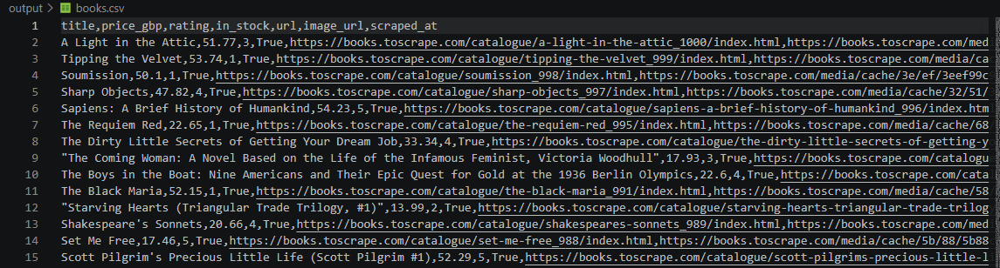

# E-commerce Product Scraper

**Scrapes all 1000 books across 50 pages from [books.toscrape.com](https://books.toscrape.com) in under a minute**, with automatic pagination, retry logic, and clean CSV/JSON output.

Built as a demonstration of production-quality scraping patterns; easily adaptable to real e-commerce sites (price monitoring, stock tracking, catalog extraction).

## Sample output



- **Books scraped:** 1000
- **Pages processed:** 50
- **Runtime:** ~45 seconds
- **Output formats:** CSV + JSON

## Features

- Extracts title, price (GBP), star rating (1-5), stock status, product URL, image URL
- Automatic pagination; follows the site's "next" link until the last page
- Retry logic with exponential backoff for transient network failures
- Polite rate limiting (0.5s between requests, configurable)
- Structured logging with timestamps and severity levels
- Graceful degradation; one malformed product doesn't kill the scrape
- Session reuse for faster HTTP throughput
- Type-hinted, dataclass-based code for maintainability

## Tech stack

Python 3.12 · requests · BeautifulSoup4 · lxml · pandas · tqdm

## Usage

```bash
git clone https://github.com/filipgurdziel/ecommerce-scraper.git
cd ecommerce-scraper
python3 -m venv venv
source venv/bin/activate
pip install -r requirements.txt
python scraper.py
```

Output lands in `output/books.csv` and `output/books.json`.

## Configuration

Edit the constants at the top of `scraper.py`:
- `START_URL`; where to begin scraping
- `MAX_PAGES`; upper limit on pages to process
- `REQUEST_DELAY`; seconds between requests (default: 0.5)

## Adapting to other sites

The scraper is structured around three extension points:
1. **`Scraper.fetch()`**; HTTP layer (rarely needs changes)
2. **`Scraper.parse_book()`**; update CSS selectors for your target site
3. **`Book` dataclass**; add or remove fields as needed

For JavaScript-heavy sites (React SPAs, lazy-loaded content), swap `requests + BeautifulSoup` for `Playwright`.

## Responsible scraping

This scraper:
- Respects `robots.txt`
- Uses polite rate limiting
- Identifies itself with a standard User-Agent
- Scrapes only publicly accessible data

If adapting for production use, ensure compliance with the target site's Terms of Service and applicable data protection laws (GDPR, etc.).

## License

MIT — see [LICENSE](LICENSE)
